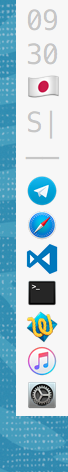

# minidock

&nbsp;&nbsp;&nbsp; 
&nbsp;&nbsp;&nbsp; 
&nbsp;&nbsp;&nbsp; 

*minidock* is an application for [iTerm2](https://www.iterm2.com) that
creates a miniature dock (26 px wide) with a list of currently open apps
and some status information from the Menu Bar.
It is intended to be used with the Menu Bar & Dock hidden for
screen estate/minimalism.

- Requires [iTerm2](https://www.iterm2.com) in 'No Title Bar' mode
- Creates a tiny display placed at the middle right side or the top right
  corner with
  - clock - hour & minute
  - input language as a flag
  - audio output device name (first letter) and volume (- mute, 0~9, | full)
  - internet connection (nc - no connection, country - if on VPN)
  - currently open apps (dot on focused app)


# How to use

- Clone repository and build binaries with `build.sh`
- Run within [iTerm2](https://www.iterm2.com) after setting
  - Profiles > Window > Style > No Title Bar
  - Profiles > Terminal > (off) Disable session-initialized window resizing
- Above screenshots were taken after setting
  - Profiles > Colors (Background/Cursor f4f4f4)
  - Profiles > Text > Font (14pt Menlo Regular, Anti-aliased)
- Edit `$HOME/.minidockrc` to configure behavior
- For more convenience, put the *iTerm2* window in overlay mode
  (always on top, semi-transparent, and mouse input falls through)
  using *Afloat* plugin in [mySIMBL](https://github.com/w0lfschild/mySIMBL)
- To launch on *iTerm2* startup, edit `.bash_profile` to include
```bash
    if [ $TERM_PROGRAM = 'iTerm.app' ]; then
        if [ `ps | grep -c 'minidock'` = 1 ]; then
            export PS1='' # empty prompt
            relative/path/to/minidock & # run in background
        else
            : # usual init stuff
        fi
    fi
```


## Displaying icons in the app list
- Modify `$HOME/.minidockrc` to include `applist_use_icons 1`
- Extract icons from `/Applications/*/*.app`s using `extract_icons.sh`
- Put them in `icons` directory as `icons/$APPNAME.png`, where `$APPNAME`s
  can be found by using `bin/print_app` while the apps are running
