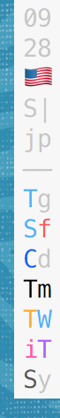

# minidock.sh

&nbsp;&nbsp;&nbsp; 
&nbsp;&nbsp;&nbsp; 
&nbsp;&nbsp;&nbsp; 

`minidock.sh` is a Bash script for [iTerm2](https://www.iterm2.com) that
creates a miniature dock (26 px wide) with a list of currently open apps
and some status information usually served on the Menu Bar.
It is intended to provide just enough information to help make macOS less
inconvenient with the Menu Bar & Dock hidden for screen estate/minimalism.

- Requires [iTerm2](https://www.iterm2.com) in 'No Title Bar' mode
- Creates a tiny display with
  - clock - hour & minute
  - (optional) input language as a flag
  - (optional) audio output device name (first letter) 
               and volume (- mute, 0~9, | full)
  - (optional) internet connection
               (nc - no connection, country - to tell if on VPN)
  - (optional) currently open apps (dot on focused app)
- Placed at the middle right side or the top right corner;
  automatically adjusts to screen size changes 


# How to use

- Clone repository
- Build auxiliary tools with `build.sh`
  - requires *Xcode Command Line Tools* (`xcode-select --install`)
    or full *Xcode*
- Configure optional lines in `minidock.sh`
- Run within [iTerm2](https://www.iterm2.com) after setting
  - Profiles > Colors (Background/Cursor f7f7f7) (optional)
  - Profiles > Text > Font (14pt Menlo Regular, Anti-aliased) (optional)
  - Profiles > Window > Style > No Title Bar
  - Profiles > Terminal > (off) Disable session-initialized window resizing
  - Keys > Show/hide *iTerm2* with a system-wide hotkey
  - Advanced > Hide *iTerm2* from the dock (optional)
- If *iTerm2* is not showing up, use the show/hide hotkey (`cmd-space`)
  after focusing on a different window
- To launch on *iTerm2* startup, edit `.bash_profile` to include
  (unless run in background with a ` &`, it will have trouble exiting cleanly)
```bash
    if [ $TERM_PROGRAM = 'iTerm.app' ]; then
        relative/path/to/minidock.sh &
    fi
```


## To use `print_app_icons.sh`
- Icons need to be placed in `icons/` as `$APPNAME.png`;
  they cannot be uploaded here due to copyright issues
- If `$APPNAME.png` is not present, the app will be displayed as grey text
  (first two letters)
- To figure out the right `$APPNAME` for an app, use `print_app`;
  name tends to be (but not always) the same as shown on the macOS Menu Bar 
- Icons can be extracted from `.app` by finding the `.icns` file in
  `$APP.app/Contents/Resources`;
  the extracted images are usually `.tiff` files and will need conversion
- Icons can be any size, but large images will slow *iTerm2* down
  (used icons resized to `64×64` in the screenshot above)


## Notes
- For consistent behavior in a multi-screen scenario,
  this script should be launched without external screens first
- `print_app_icons.sh` can be a bit CPU-taxing, so be cautious
  if you're mainly on battery
